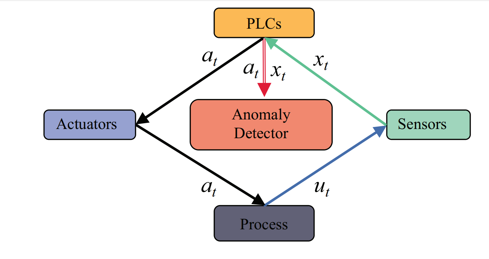
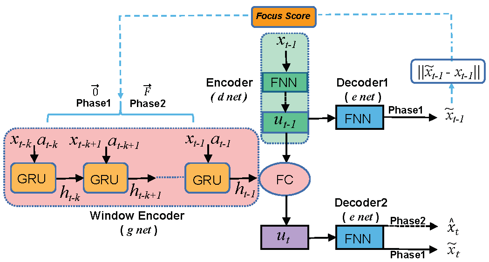

# NSIAD
### Neural System Inference Networks with Adversarial Training for  Anomaly Detection in Cyber-Physical Systems


## Overview
<p align="justify">
Efficient anomaly detection in multivariate time series data is essential for the safe operation of modern Cyber-Physical Systems (CPSs). However, developing a system capable of accurately and efficiently identifying anomalous instances in CPS remains a significant challenge. This challenge arises from several factors, including the dataset's heavy reliance on labeled data and the learning process's high sensitivity to data volatility and sensor noise. In this paper, we propose a Neural System Inference network for Anomaly Detection (NSIAD), to capture the temporal trends in CPS time series using a stable learning framework with low dependence on the dataset. First, it employs a focus score-based self-conditioning mechanism to facilitate robust multi-modal feature extraction. Second, it leverages an adversarial training procedure to ensure training stability. Third, by incorporating the model-agnostic meta-learning mechanism, our approach enables efficient training, even with limited data samples. Extensive empirical studies, comparing NSIAD with ten baseline methods on various datasets, demonstrate that our approach significantly improves anomaly detection performance. Finally, the ablation study empirically justifies the effectiveness of each functional component in our approach. 
</p>

## Architecture
<div style="display:flex; justify-content:space-between;">
  
  
</div>

## Getting Started
#### Install dependencies (with python 3.6) 
```shell
pip install -r requirements.txt
```
## Usage
#### Run the qualitative experiment
```shell
cd experiments
python qualitative_experiment.py
```
#### Run the PUMP experiment
```shell
cd experiments
python PUMP_experiement.py
```
#### Run the WADI experiment
```shell
cd experiments
python WADI_experiement.py
```
#### Run the SWAT experiment
```shell
cd experiments
python SWAT_experiement.py
```
## Dataset
All dataset zip files are available in the [datasets](./datasets)
 folder of our repository. Simply clone our code, and you'll find the relevant dataset processing scripts there for easy usage.
## License
This project is under the Apache 2.0 license. See [LICENSE](./LICENSE.md) for details.


